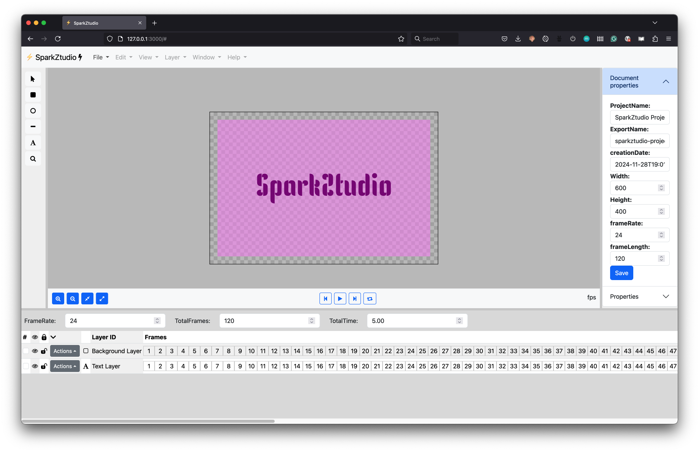

# SparkZtudio

POC Flash rebuild with web tech (Flash / Spark) ???

- 🔥
- ⚡️
- 📸
- 🔋



check progres on: https://matthijskamstra.github.io/SparkZtudio/

## SVG start

- default svg in canvas
- open `.sparkz`/`.json` file
- import `.svg`

## Layout

```
+---------------------------------------+
| menu                                  |
|---------------------------------------|
|       |                  |            |
| tools | canvas           | properties |
|       |                  |            |
|       |                  |
|       |                  | document   |
|       |------------------|------------|
|       | canvas menu      | properties |
|       |                  |            |
+---------------------------------------+
| timeline menu                         |
|---------------------------------------|
|                                       |
| timeline                              |
|                                       |
+---------------------------------------+


```

## Resources

- https://ficons.fiction.com/reference.html
- https://getbootstrap.com/docs/5.3/components/buttons/#disabled-state
- https://picsum.photos/
- https://placehold.co/

- https://picsum.photos/id/56/200/300

## font render

important: font needs to be installed on computer! otherwise the font will not render correctly
